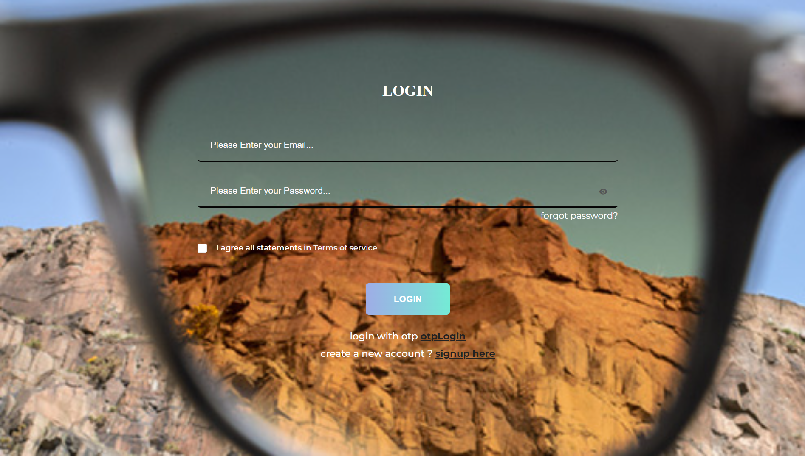
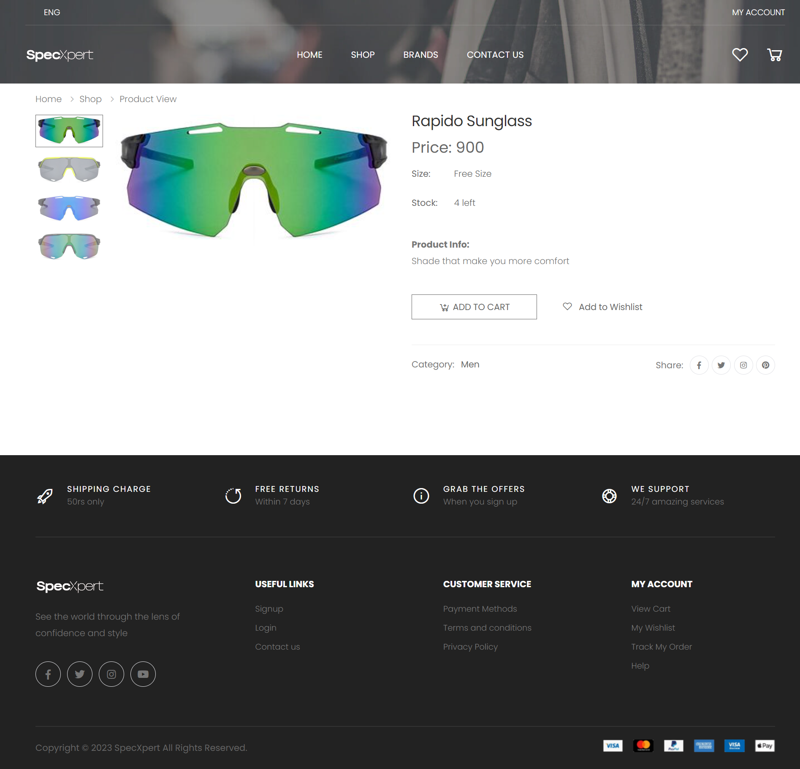
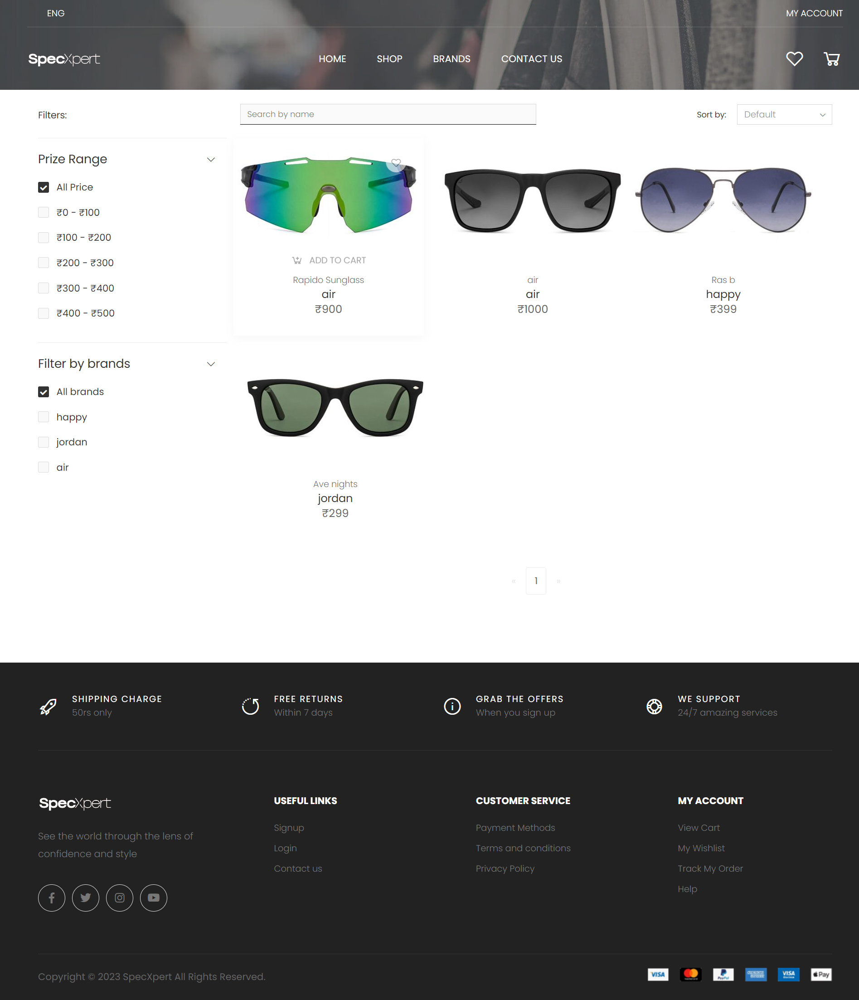
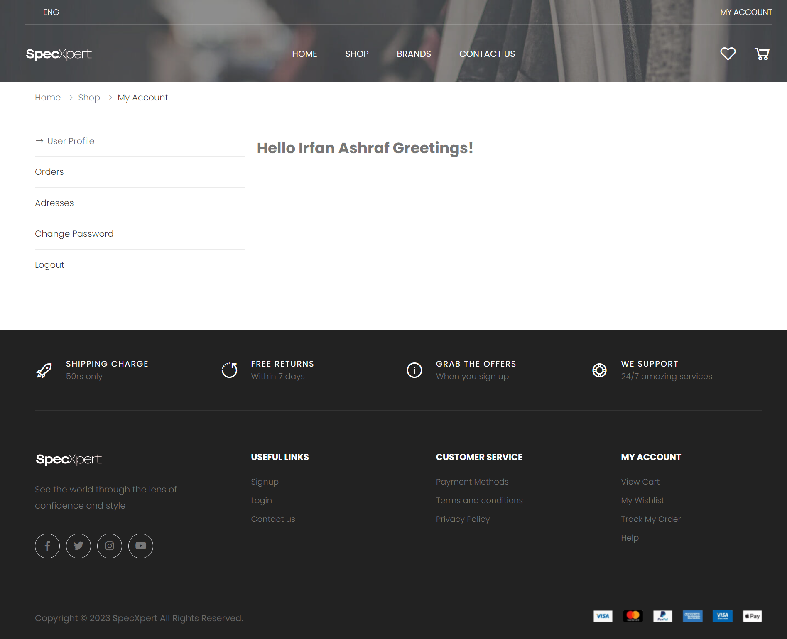
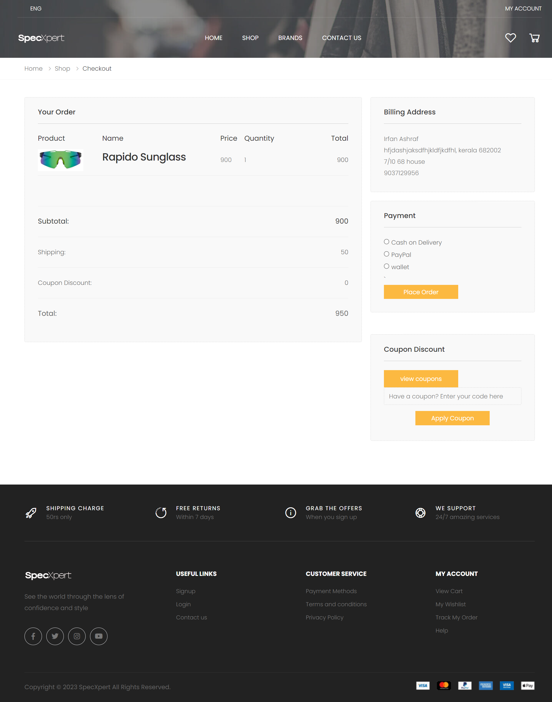
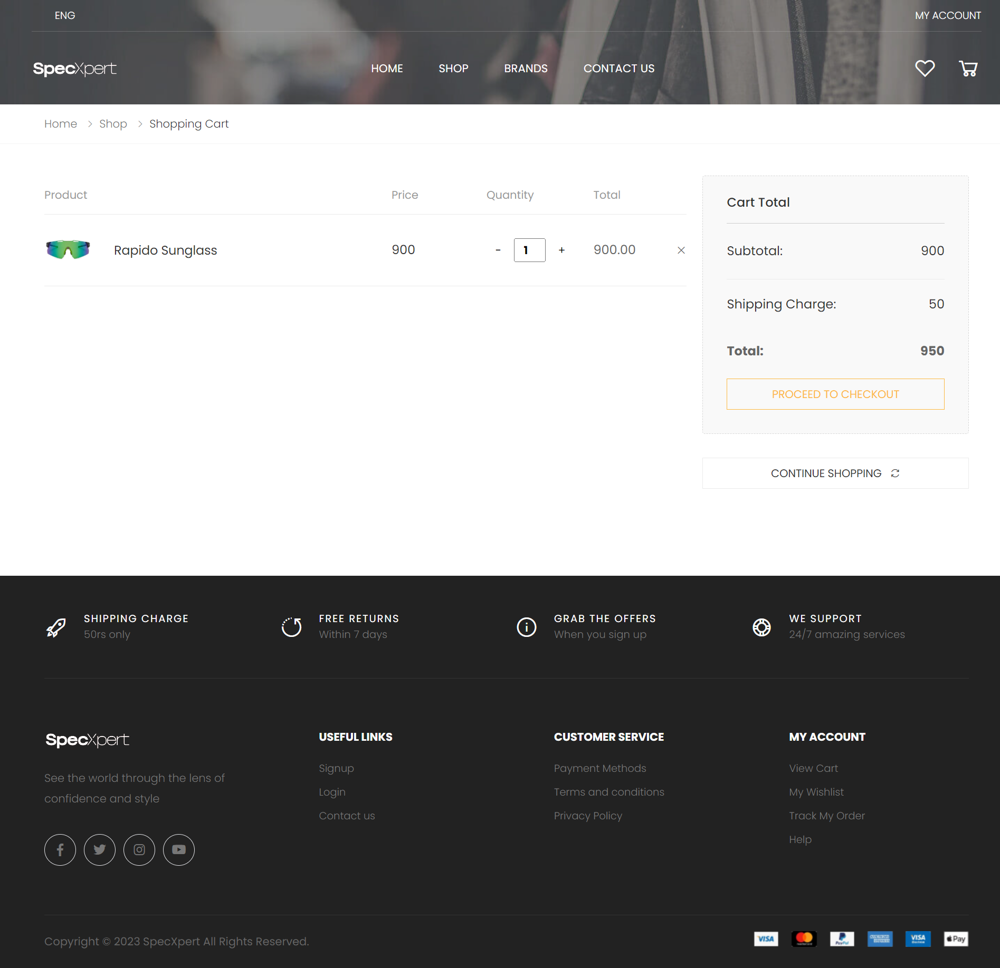
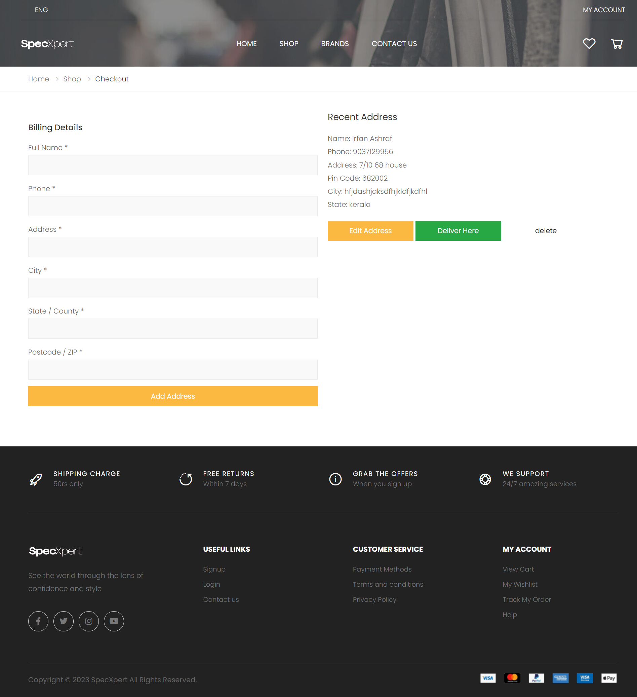
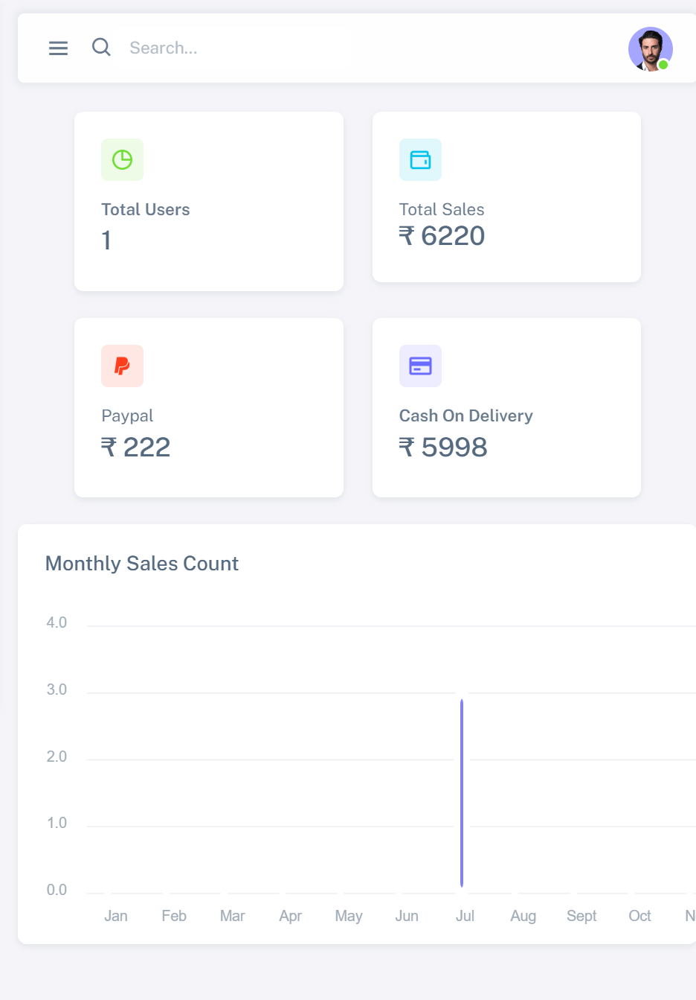
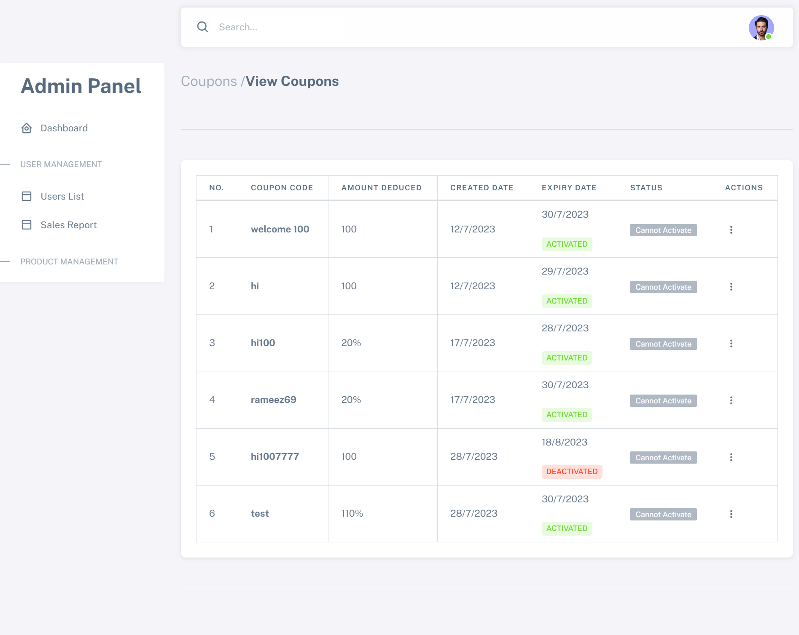
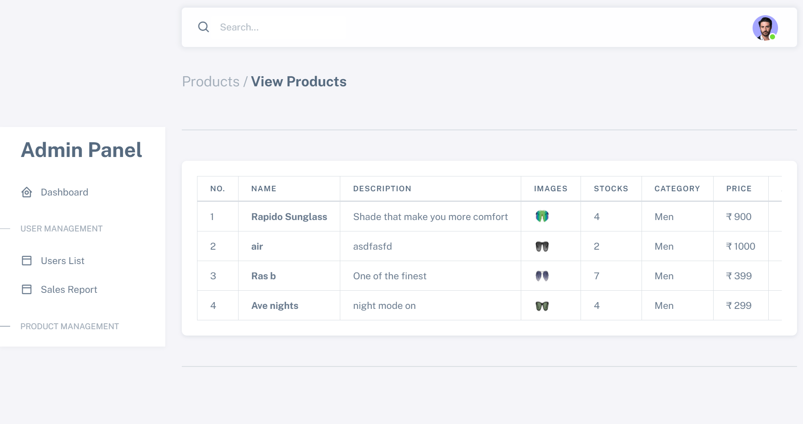

# Specxpert

## Overview

**Specxpert** is an e-commerce platform focused on selling sunglasses, designed to showcase backend technologies and implement server-side rendering using the EJS templating engine. The platform provides users with a seamless shopping experience, allowing them to browse, select, and purchase products with integrated payment options.

## Purpose

Specxpert was built to demonstrate the implementation of backend technologies in an e-commerce environment. It allows users to shop for sunglasses while showcasing server-side rendering and key e-commerce functionalities like product management, order processing, and payment integrations.

## Key Features

- **Authentication**: Secure user login and session management.
- **Shopping Experience**: Users can explore various sunglasses, add items to their cart, and proceed to checkout.
- **Checkout Process**: Includes user detail collection and multiple payment options (PayPal or cash on delivery).
- **Order Summaries & Downloads**: Generates downloadable Excel and PDF documents for order summaries or invoices.
- **Product Management**: Admin users can manage product listings, including uploading images and product details.

## Technology Stack

- **Backend Framework**: Node.js with Express for routing and server-side functionality.
- **Templating Engine**: EJS for server-side rendering and dynamic content embedding in HTML.
- **Database**: MongoDB, managed via Mongoose for data persistence.

## Key Libraries

- **exceljs**: Generates and reads Excel files, useful for generating order reports.
- **express-session**: Manages user sessions for login persistence.
- **express-validator**: Validates and sanitizes user input for enhanced security.
- **mongoose**: Simplifies interaction with MongoDB for data management.
- **multer**: Handles file uploads, typically for product images.
- **paypal-rest-sdk**: Integrates PayPal for secure online payment processing.
- **twilio**: Provides SMS notifications and communication services.

## Image Preview

Here are some preview images showcasing the app:

